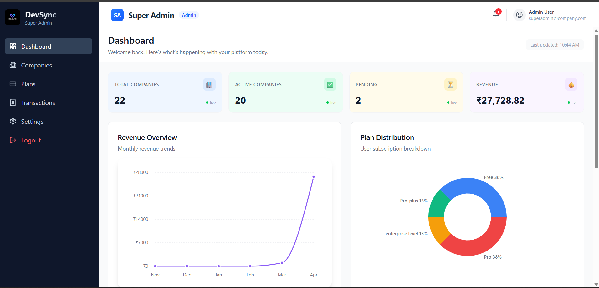
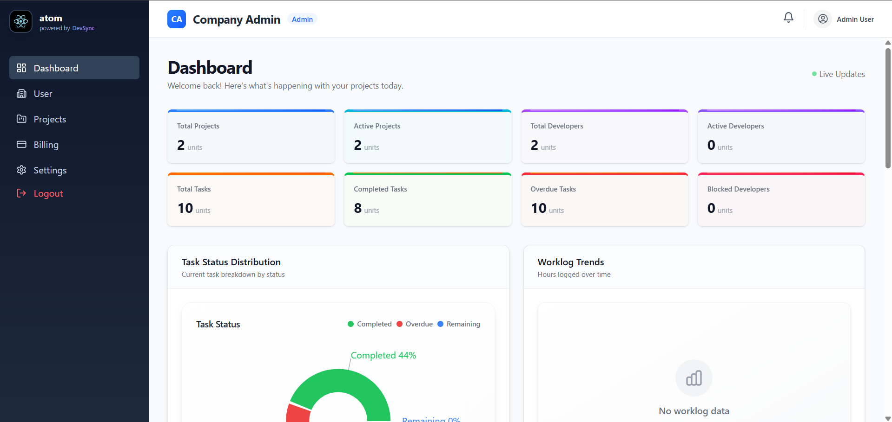
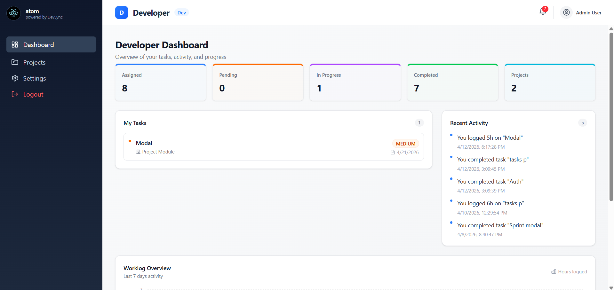
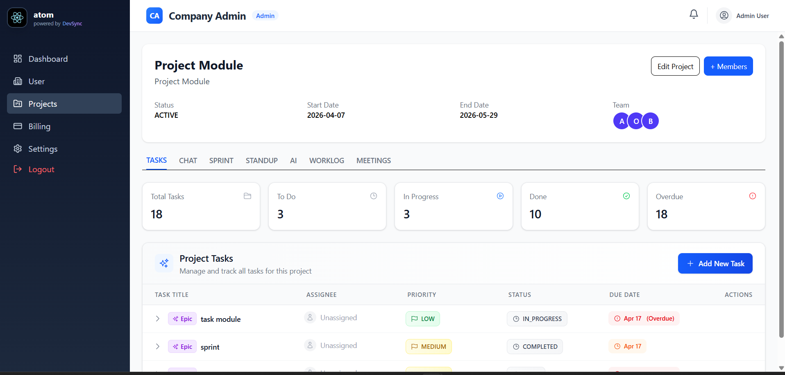
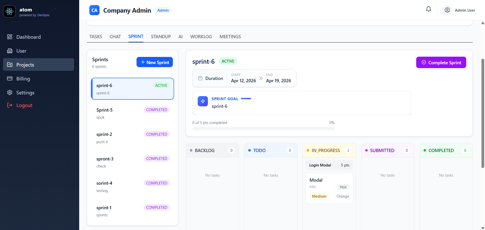
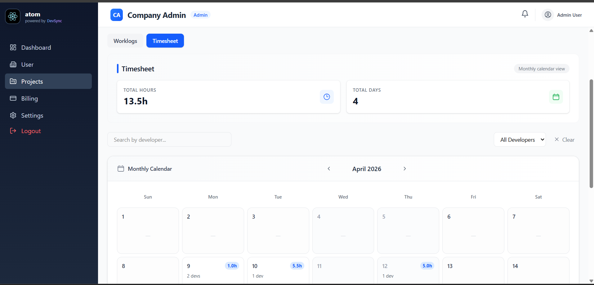
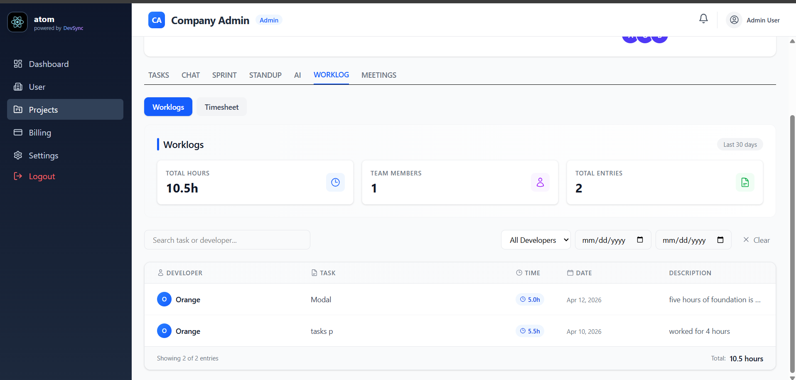
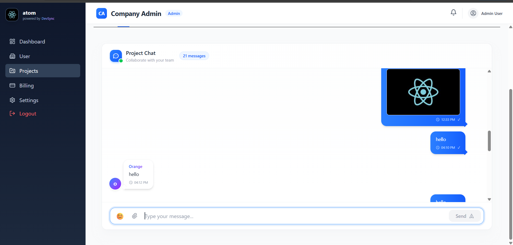
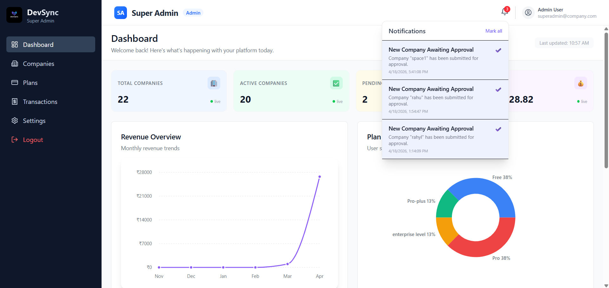

# DevSync 🚀
A modern full-stack project management platform designed to streamline team collaboration, task tracking, and productivity with real-time communication and scalable architecture.

---

## 📖 Introduction
DevSync is a role-based project management system that enables organizations to efficiently manage teams, projects, and workflows. It supports multiple user roles such as Super Admin, Company Admin, and Developer, each with dedicated dashboards and capabilities.

---

## 🎯 Problem Statement
Managing projects across teams without a structured system leads to poor communication, lack of visibility, and reduced productivity. DevSync solves this by providing a centralized platform with real-time updates, role-based access, and workflow management.

---

## ✨ Features

### 🔐 Authentication & Roles
- JWT-based authentication
- Role-Based Access Control (Super Admin, Company Admin, Developer)

### 🏢 Organization & Project Management
- Company onboarding and management
- Project creation and assignment
- Sprint planning and tracking

### 📁 Task & Workflow Management
- Task assignment and tracking
- Sprint transactions
- Worklogs and timesheets

### ⚡ Real-Time Features (WebSockets)
- 🔔 Real-time notifications
- 💬 Real-time team chat
- Live updates across dashboards

### 📅 Scheduling & Collaboration
- Meeting scheduling system
- Team coordination tools

### 💳 Subscription System
- Company-based subscription plans
- Access control based on subscription

### 📊 Productivity & Insights
- Dashboard analytics
- Manual & calculated productivity insights

### 📱 Progressive Web App (PWA)
- Installable app experience
- Mobile-friendly design

### 🚀 DevOps & Workflow
- CI/CD pipeline for backend
- Agile methodology (Sprint-based development)

---

## 🛠️ Tech Stack

### 🎨 Frontend
- React.js (TypeScript)
- Redux Toolkit
- Tailwind CSS 
- Axios
- PWA (Service Workers)

### ⚙️ Backend
- Node.js
- Express.js
- Socket.io (WebSockets)
- JWT Authentication

### 🗄️ Database
- MongoDB (Mongoose)

### 🔄 DevOps & Tools
- Git & GitHub
- CI/CD (Backend)
- Postman

### 🧠 Architecture & Practices
- Clean Architecture (Frontend & Backend)
- Agile Methodology

---

## 🏗️ Architecture

DevSync follows **Clean Architecture** principles across both frontend and backend.

### 🔹 Backend
src/
├── application
├── domain
├── infrastructure
├── interfaces
├── di
├── config
├── shared


### 🔹 Frontend
src/
├── core
├── modules
├── shared
├── store
├── router
├── assets


### ✅ Benefits
- Scalable and maintainable codebase  
- Clear separation of concerns  
- Easier testing and debugging  
- Clean integration of real-time systems  

---

## 📸 Screenshots

### 📊 Role-Based Dashboards

#### 🛡️ Super Admin


#### 🏢 Company Admin


#### 👨‍💻 Developer


---

### 📁 Project Management


---

### 🔄 Sprint Management


---

### ⏱️ Worklogs & Timesheets



---

### 💬 Real-Time Chat


---

### 🔔 Notifications


---

## ⚙️ Installation

### 1️⃣ Clone the repository
```bash
git clone https://github.com/Rahul181007/devsync-PR-.git
cd devsync-PR-


2️⃣ Setup Backend
cd backend
npm install

Create .env file:
PORT=5000
MONGO_URI=your_mongo_uri
JWT_SECRET=your_secret

Run backend:
npm run dev


3️⃣ Setup Frontend
cd frontend
npm install
npm run dev